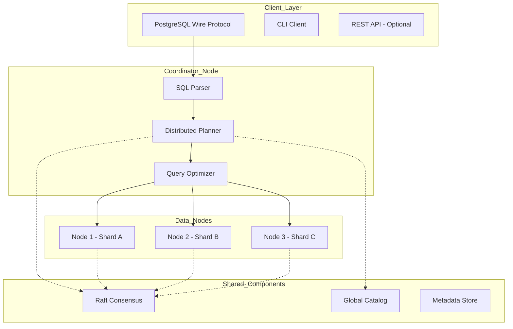
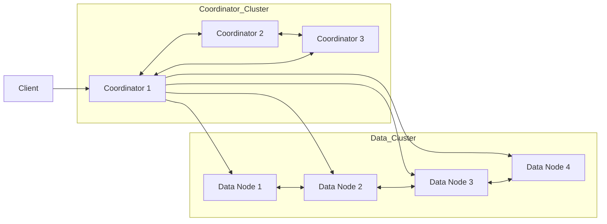
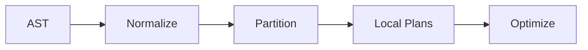
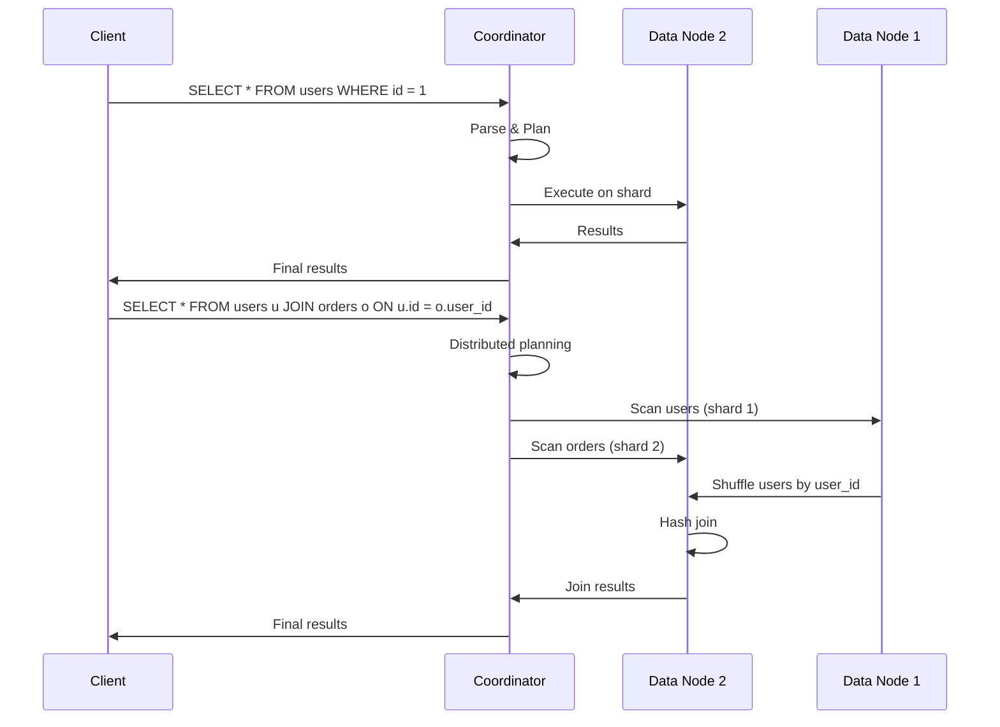
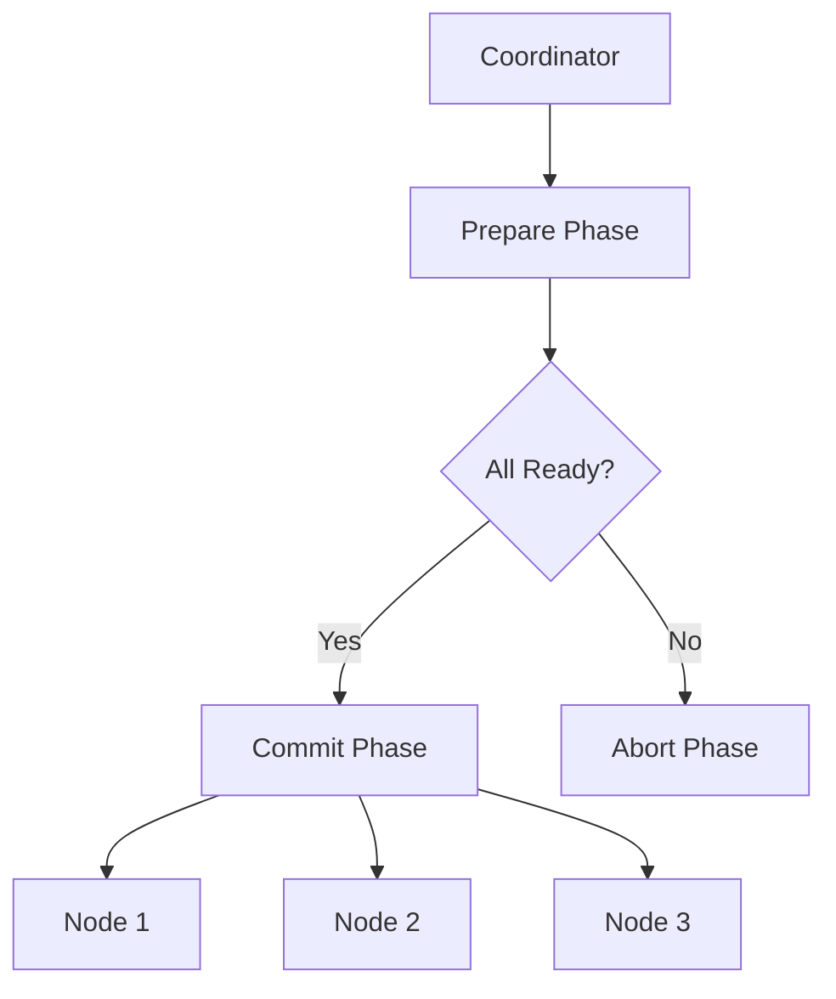
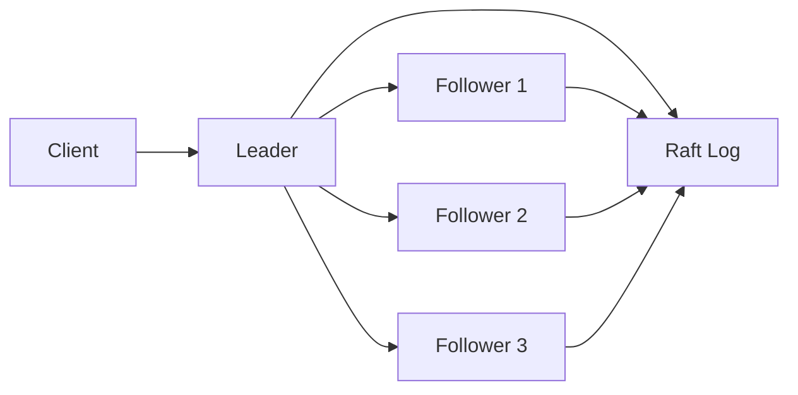

# SQL Engine Architecture (Distributed Edition)

## Project Overview

A lightweight, cost-effective PostgreSQL alternative for cloud users with **distributed architecture** built-in from day one.

### Goals
- **Lightweight**: Minimal resource footprint
- **Cost-effective**: Cheap to run in cloud environments
- **Distributed**: Horizontal scaling from the start
- **User-friendly**: Simple for average users
- **Educational**: Clear, well-documented codebase

### Target Use Cases
- Small to medium web applications
- Distributed microservices
- Development and staging environments
- Learning platforms
- Edge computing scenarios

---

## Architecture Principles

1. **Simplicity over optimization** - Readable, maintainable code
2. **Distributed-first** - Sharding and replication built-in
3. **PostgreSQL-compatible wire protocol** - Tools work out of the box
4. **Minimal feature set** - Cover 80% of use cases, not edge cases

---

## System Architecture

### High-Level Overview



### Single-Node vs Distributed Mode

The engine can run in two modes:

| Mode | Description | Use Case |
|------|-------------|----------|
| **Embedded** | Single process, no network | Development, edge devices |
| **Distributed** | Coordinator + Data nodes | Production cloud deployments |

---

## Distributed Architecture

### Node Types



#### 1. Coordinator Node
- Receives client connections (PostgreSQL protocol)
- Parses and plans distributed queries
- Manages transaction metadata
- Doesn't store user data

#### 2. Data Node
- Stores table shards (horizontal partitioning)
- Executes local query fragments
- Participates in Raft consensus for metadata
- Can be read replicas or primary shards

### Sharding Strategy

**Hash Sharding** (Default):
```
shard_id = hash(primary_key) % num_shards
```

**Range Sharding** (For time-series):
```
shard_id = primary_key / range_size
```

**Custom Sharding**:
- User-defined sharding keys
- Geographic sharding support

### Replication Model

```mermaid
flowchart TB
    subgraph Shard_Group
        Primary[Primary Node]
        Replica1[Replica 1 - Sync]
        Replica2[Replica 2 - Async]
    end
    
    Client --> Primary
    Primary --> Replica1
    Primary --> Replica2
    
    Replica1 -.-> "WAL Sync" .-> Primary
    Replica2 -.-> "WAL Async" .-> Primary
```

**Replication Levels**:
- **Sync**: All replicas ack before commit
- **Semi-sync**: One replica acks before commit
- **Async**: No ack required (fastest, riskier)

---

## Component Design

### 1. Network Layer (PostgreSQL Wire Protocol + Internal RPC)

**Purpose**: Accept connections from clients and coordinate between nodes

**External Protocol** (Client-facing):
- PostgreSQL wire protocol for client connections
- Standard tools (psql, drivers) work out of the box

**Internal Protocol** (Node-to-node):
- gRPC for coordinator-data communication
- Raft for consensus communication

**Educational Value**: Learn dual-protocol design, RPC frameworks

### 2. SQL Parser

**Purpose**: Convert SQL text into internal query representation

**Components**:
```
SQL Text → Lexer → Parser → AST → Distributed Query Plan
```

**Supported Syntax**:
```sql
-- DDL
CREATE TABLE users (id INT PRIMARY KEY, name VARCHAR(100));
CREATE TABLE orders (id INT PRIMARY KEY, user_id INT, amount DECIMAL(10,2));
CREATE INDEX idx_user_name ON users(name);

-- DML with sharding awareness
SELECT * FROM users WHERE id = 1;           -- Routes to single shard
SELECT * FROM users WHERE name = 'John';    -- Broadcasts to all shards
SELECT * FROM users u JOIN orders o         -- Distributed join
  ON u.id = o.user_id WHERE u.id = 1;

-- Aggregations (distributed)
SELECT status, COUNT(*) FROM orders GROUP BY status;
SELECT AVG(amount) FROM orders WHERE user_id = 1;
```

**Sharding Awareness**:
- Qualified shard key → Direct to single shard
- Unqualified → Broadcast to all shards
- JOINs with sharding keys → Distributed join

**Educational Value**: Lexer/parser design, distributed query parsing

### 3. Query Planner & Optimizer

**Purpose**: Convert AST into efficient distributed execution plan

**Planning Stages**:



**1. Query Normalization**:
- Expand views
- Simplify expressions
- Resolve column references

**2. Partition Analysis**:
- Identify sharding key in WHERE clause
- Determine if query is shard-local or broadcast
- Split JOINs into local and distributed parts

**3. Local Planning**:
- Generate execution plan for each shard
- Plan data movement between shards

**4. Optimization**:
- Push down predicates
- Eliminate unnecessary columns
- Choose join strategies (hash join, merge join)

**Educational Value**: Distributed query planning, cost-based optimization

### 4. Execution Engine

**Purpose**: Execute distributed query plans

**Execution Model**: Volcano-style with distributed extensions

**Operators**:
- `DistributedScan` - Scan local shard or broadcast
- `DistributedJoin` - Shuffle-based join
- `HashShuffle` - Data redistribution for joins
- `Gather` - Collect results to coordinator
- `Broadcast` - Send data to all shards

**Query Execution Flow**:



**Educational Value**: Distributed execution, data shuffling, operator design

### 5. Transaction Manager

**Purpose**: Provide ACID guarantees across distributed nodes

**Isolation Level**: Read Committed + Snapshot Isolation

**Distributed Transaction Protocol**:



**Two-Phase Commit (2PC)**:
1. **Prepare**: Coordinator asks all participants to prepare
2. **Commit**: If all participants ready, coordinator sends commit
3. **Abort**: If any participant fails, coordinator sends abort

**Conflict Detection**:
- Row-level locking for writes
- MVCC snapshot isolation for reads
- Optimistic concurrency for distributed transactions

**Write-Ahead Log**:
- Distributed WAL coordination
- Log sequencing across nodes
- Crash recovery with log replay

**Educational Value**: Distributed transactions, 2PC, MVCC, crash recovery

### 6. Storage Engine

**Purpose**: Persist and retrieve data efficiently across nodes

**Design**: Row-oriented heap files with B-tree indexes per shard

**Per-Node File Structure**:
```
data/{node_id}/
├── system/
│   ├── pg_database
│   ├── pg_class
│   ├── pg_attribute
│   └── pg_shard_catalog
├── shard_{shard_id}/
│   ├── {table}.heap
│   ├── {table}_pkey.idx
│   ├── FSM
│   └── WAL/
│       └── 0000000000000001.wal
└── replication/
    ├── replication_state
    └── follower_nodes.json
```

**Buffer Pool**:
- Fixed-size pages (8KB default)
- LRU eviction policy
- Distributed cache coordination (optional)

**Indexes**:
- B-tree for primary keys
- Secondary B-tree indexes
- Shard-local vs global indexes

**Global vs Local Indexes**:
- **Local Index**: Index on shard, query broadcasts to all shards
- **Global Index**: Index maintained across shards, maintained via gossip

**Educational Value**: Distributed storage, replication, indexing

### 7. Raft Consensus

**Purpose**: Maintain consistent metadata across coordinator nodes

**Raft Integration**:


**Managed Metadata**:
- Database schema definitions
- Shard mapping (which node owns which shard)
- Node membership and health
- Transaction log positions

**Educational Value**: Consensus algorithms, distributed consistency

### 8. Catalog System

**Purpose**: Global schema and metadata management

**Catalog Contents**:
- Database definitions
- Table schemas with column types
- Sharding configuration per table
- Index definitions
- User and permission information

**Catalog Operations**:
- DDL statements update global catalog
- Catalog changes replicated via Raft
- Cached at coordinator nodes for performance

**Educational Value**: Metadata management, catalog design

---

## Data Types

| Category | Types |
|----------|-------|
| Integer | INT, BIGINT, SMALLINT |
| Float | FLOAT, DOUBLE, DECIMAL |
| String | VARCHAR(n), TEXT |
| Boolean | BOOLEAN |
| Date/Time | DATE, TIME, TIMESTAMP |
| JSON | JSON (basic support) |

---

## API & Compatibility

### PostgreSQL Wire Protocol Support

**Supported Messages**:
- `StartupMessage` - Initial connection
- `PasswordMessage` - Authentication
- `Query` - Execute SQL
- `Parse`, `Bind`, `Execute` - Extended protocol
- `Sync`, `Flush` - Protocol flow

### Cluster Management API

**Internal APIs** (Node-to-node):
```protobuf
service NodeService {
    rpc ExecuteQuery(QueryRequest) returns (QueryResponse);
    rpc StreamRows(StreamRequest) returns (stream Row);
    rpc ReplicateWAL(WALRequest) returns (WALResponse);
    rpc ReportHealth(HealthRequest) returns (HealthResponse);
}

service RaftService {
    rpc RequestVote(VoteRequest) returns (VoteResponse);
    rpc AppendEntries(EntriesRequest) returns (EntriesResponse);
}
```

**Admin APIs** (Cluster management):
```
# Add node to cluster
POST /admin/node/add
{ "node_id": "node-4", "address": "10.0.0.4" }

# Rebalance shards
POST /admin/shard/rebalance
{ "strategy": "even_distribution" }

# Failover to replica
POST /admin/node/failover
{ "shard_id": "shard-2", "replica_id": "replica-1" }
```

---

## Deployment Model

### Development Mode (Embedded)

```
┌─────────────────────────────────────────┐
│       Single Process (Embedded)          │
├─────────────────────────────────────────┤
│  Network Layer (PostgreSQL Port 5432)   │
├─────────────────────────────────────────┤
│  Query Engine (All components)          │
├─────────────────────────────────────────┤
│  Storage Engine (Local files)           │
└─────────────────────────────────────────┘
```

### Production Mode (Distributed)

```
┌─────────────────────────────────────────────────────────────┐
│                     Load Balancer                            │
└─────────────────────────────────────────────────────────────┘
                               │
              ┌────────────────┼────────────────┐
              ▼                ▼                ▼
    ┌─────────────────┐ ┌─────────────────┐ ┌─────────────────┐
    │   Coordinator   │ │   Coordinator   │ │   Coordinator   │
    │   (Raft Leader)  │ │   (Follower)    │ │   (Follower)    │
    └─────────────────┘ └─────────────────┘ └─────────────────┘
              │                │                │
              └────────────────┼────────────────┘
                               │
              ┌────────────────┼────────────────┐
              ▼                ▼                ▼
    ┌─────────────────┐ ┌─────────────────┐ ┌─────────────────┐
    │  Data Node 1    │ │  Data Node 2    │ │  Data Node 3    │
    │  Shard 1, 4     │ │  Shard 2, 5     │ │  Shard 3, 6     │
    │  (Primary)      │ │  (Primary)      │ │  (Primary)      │
    └─────────────────┘ └─────────────────┘ └─────────────────┘
              │                │                │
              └────────────────┼────────────────┘
                               │
              ┌────────────────┼────────────────┐
              ▼                ▼                ▼
    ┌─────────────────┐ ┌─────────────────┐ ┌─────────────────┐
    │  Replica 1-1    │ │  Replica 2-1    │ │  Replica 3-1    │
    │  (Sync)         │ │  (Async)        │ │  (Sync)         │
    └─────────────────┘ └─────────────────┘ └─────────────────┘
```

### Kubernetes Deployment

```yaml
# coordinator-statefulset.yaml
apiVersion: apps/v1
kind: StatefulSet
metadata:
  name: sqlengine-coordinator
spec:
  serviceName: coordinator
  replicas: 3
  spec:
    containers:
    - name: coordinator
      image: sqlengine/coordinator:latest
      ports:
      - containerPort: 5432
      env:
      - name: CLUSTER_SIZE
        value: "3"
---
# data-node-statefulset.yaml
apiVersion: apps/v1
kind: StatefulSet
metadata:
  name: sqlengine-datanode
spec:
  serviceName: datanode
  replicas: 6
  spec:
    containers:
    - name: datanode
      image: sqlengine/datanode:latest
      volumeMounts:
      - name: data
        mountPath: /data
```

### Resource Targets

| Mode | CPU | Memory | Storage |
|------|-----|--------|---------|
| Embedded | 1 core | 512MB | 1GB SSD |
| Coordinator | 2 cores | 2GB | N/A |
| Data Node | 4 cores | 8GB | 100GB SSD |

---

## Cost Optimization Strategies

### 1. Efficient Resource Usage
- Small binary size (< 20MB)
- Minimal dependencies
- Compressed wire protocol

### 2. Elastic Scaling
- Scale coordinators independently from data nodes
- Add read replicas without resharding
- Auto-scale based on query load

### 3. Storage Efficiency
- Columnar compression option for analytics
- Automatic tiering (hot/cold data)
- Transparent compression

### 4. Network Efficiency
- Protocol compression
- Connection pooling
- Batch queries

---

## Project Roadmap

### Phase 1: Core Engine (Single Node)
- [ ] Network layer with PostgreSQL protocol
- [ ] SQL parser for DDL and basic DML
- [ ] Simple query executor
- [ ] Heap file storage with sequential scan
- [ ] Basic crash recovery

### Phase 2: Single-Node Features
- [ ] B-tree index implementation
- [ ] Buffer pool with LRU eviction
- [ ] Index scan execution
- [ ] MVCC and transaction support

### Phase 3: Distributed Foundation
- [ ] Raft consensus for coordinator
- [ ] Node membership management
- [ ] Basic sharding (hash-based)
- [ ] Coordinator-data node communication

### Phase 4: Distributed Operations
- [ ] Distributed query planning
- [ ] Shuffle-based distributed joins
- [ ] Replication (sync/async)
- [ ] Distributed transactions (2PC)

### Phase 5: Production Hardening
- [ ] Connection pooling
- [ ] Backup/restore
- [ ] Auto-rebalancing
- [ ] Monitoring and observability

---

## File Structure

```
sqlEngine/
├── src/
│   ├── network/
│   │   ├── postgres_protocol.c    # PostgreSQL wire protocol
│   │   ├── grpc_service.c         # Internal RPC
│   │   └── connection.c           # Connection handling
│   ├── parser/
│   │   ├── lexer.l               # Lexical analysis
│   │   └── parser.y              # Syntax analysis
│   ├── planner/
│   │   ├── ast.c                 # AST node definitions
│   │   ├── planner.c             # Query planning
│   │   └── distributed_planner.c # Distributed planning
│   ├── executor/
│   │   ├── operators.c           # Execution operators
│   │   ├── executor.c            # Volcano executor
│   │   └── distributed_exec.c    # Distributed execution
│   ├── storage/
│   │   ├── heap.c                # Heap file storage
│   │   ├── btree.c               # B-tree indexes
│   │   └── buffer.c              # Buffer pool
│   ├── transaction/
│   │   ├── wal.c                 # Write-Ahead Log
│   │   ├── lock.c                # Lock manager
│   │   ├── mvcc.c                # Version store
│   │   └── distributed_txn.c     # Distributed transactions
│   ├── sharding/
│   │   ├── sharding.c            # Sharding logic
│   │   └── rebalancer.c          # Shard rebalancing
│   ├── replication/
│   │   ├── replication.c         # Replication manager
│   │   └── failover.c            # Failover handling
│   ├── raft/
│   │   ├── raft.c                # Raft consensus
│   │   └── log.c                 # Raft log
│   ├── catalog/
│   │   ├── catalog.c             # Global catalog
│   │   └── metadata.c            # Metadata management
│   └── main.c                    # Entry point
├── include/
│   └── *.h                       # Public headers
├── proto/
│   ├── node_service.proto        # gRPC service definitions
│   └── raft_service.proto
├── tests/
│   ├── unit/                     # Unit tests
│   ├── integration/              # Integration tests
│   └── distributed/              # Distributed tests
├── scripts/
│   ├── build.sh                  # Build script
│   ├── test.sh                   # Test runner
│   └── deploy.sh                 # Deployment scripts
├── configs/
│   ├── coordinator.yaml
│   └── datanode.yaml
└── docs/
    ├── architecture.md
    ├── sql_reference.md
    └── deployment_guide.md
```

---

## Educational Value

### Learning Objectives

1. **Database Internals**
   - Query parsing and execution
   - Index structures (B-tree)
   - Transaction management (ACID, MVCC)

2. **Distributed Systems**
   - Consensus algorithms (Raft)
   - Sharding and partitioning
   - Distributed transactions (2PC)
   - Replication strategies

3. **Systems Programming (C)**
   - Memory management
   - File I/O and buffering
   - Concurrency and locking
   - Network programming

4. **Protocol Design**
   - PostgreSQL wire protocol
   - gRPC and protobuf
   - Client-server architecture

### Code Quality Standards

- Well-commented source code
- Modular design for easy learning
- Extensive test coverage
- Clear documentation
- Educational comments explaining design decisions

---

## Success Metrics

| Metric | Target |
|--------|--------|
| Binary Size | < 20MB |
| Startup Time | < 2 seconds |
| Simple Query Latency | < 5ms (local) / < 20ms (distributed) |
| Max Connections per Coordinator | 1000 |
| TPS (TPC-B like) | 5000+ (single node) / 20000+ (distributed) |
| Shard Rebalance Time | < 1 minute |
| Failover Time | < 10 seconds |

---

## Comparison with Existing Solutions

| Feature | This Project | SQLite | PostgreSQL | CockroachDB |
|---------|--------------|--------|------------|-------------|
| Architecture | Distributed | Embedded | Single-node | Distributed |
| Language | C/C++ | C | C | Go |
| Binary Size | ~20MB | ~1MB | ~30MB | ~100MB |
| Setup Complexity | Simple | Trivial | Moderate | Complex |
| PostgreSQL Compat | Partial | None | Full | Partial |
| Learning Curve | Moderate | Easy | Moderate | Hard |
| Cost | Very Low | Free | Free | $$$ |
| Sharding | Built-in | None | External | Built-in |
| Replication | Built-in | None | External | Built-in |

---

## References

### Inspirations
- **CockroachDB**: Distributed architecture, Raft usage
- **TiDB**: Distributed SQL layer, MySQL compatibility
- **PostgreSQL**: Wire protocol, SQL dialect, MVCC
- **Raft Paper**: Consensus algorithm

### Learning Resources
- "Database System Concepts" - Silberschatz, Korth, Sudarshan
- "Transaction Processing" - Gray, Reuter
- "Designing Data-Intensive Applications" - Martin Kleppmann
- Raft Paper: https://raft.github.io/raft.pdf
- PostgreSQL Source Code: github.com/postgres/postgres
- CockroachDB Architecture: https://www.cockroachlabs.com/docs/architecture/overview.html
